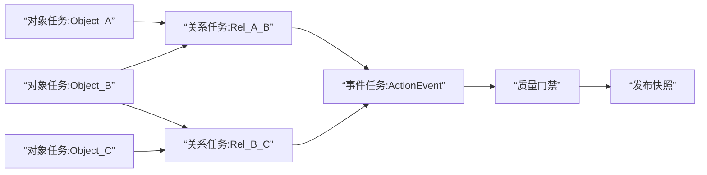

# 本体论数据平台 · 架构设计方案

> 版本：v3（文档整合）  
> 日期：2026-05-20  
> 评审范围：从技术架构、产品实施、工程实现三个角度判断可实现性，并给出可执行补充。

## 前言：项目缘起

构建一个由大模型驱动的本体论大数据平台，自动从数据库模式生成语义化的本体论元数据。

核心能力：
- 本体论建模智能体：将数据库语义抽象为本体论语义层数据，可扩展至任意数据库，经过3轮验证，支持衍化与自驱进化（通过数据内容判断对象联系、状态字段判断动作）
- 查询数据智能体：将用户自然语言转化为本体论语义查询

## 0. 本期范围锁定（当前共识）

1. **只做第一期，不进入第二期/第三期研发。**
2. **只验证 3 个源业务库**：农投财务库、农投投资库、农投人事库。
3. **本体实例层仅做 T+1 日数据更新**（不做实时 CDC）。
4. **T+1 默认调度时点为 01:00，支持用户手动配置；如需优化可进行多时点观察。**
5. 第二期、第三期内容仅保留为后续演进参考，不作为当前交付承诺。

### 0.1 一期核心对象建议清单（讨论稿）

> 说明：以下为“先跑通业务价值”的核心对象，不追求全量覆盖。每库先抓 5 个对象，满足建模、实例更新、问数闭环。

#### 农投财务库（Finance）

| 对象编码 | 对象名称 | 业务含义 | 建议 business_key | 候选增量字段 |
|---|---|---|---|---|
| FIN_VOUCHER | 会计凭证 | 核算最小业务单据 | `company_code + voucher_no + voucher_date` | `updated_at` / `op_time` |
| FIN_VOUCHER_ENTRY | 凭证明细 | 凭证借贷分录 | `company_code + voucher_no + line_no` | `updated_at` |
| FIN_ACCOUNT_SUBJECT | 科目 | 会计科目主数据 | `company_code + subject_code` | `updated_at` |
| FIN_COST_CENTER | 成本中心 | 费用归集维度 | `company_code + cost_center_code` | `updated_at` |
| FIN_AP_AR_DOC | 应收应付单据 | 往来款项管理单据 | `company_code + doc_no + doc_type` | `updated_at` / `bill_date` |

#### 农投投资库（Investment）

| 对象编码 | 对象名称 | 业务含义 | 建议 business_key | 候选增量字段 |
|---|---|---|---|---|
| INV_PROJECT | 投资项目 | 投资管理核心对象 | `project_code` | `updated_at` / `project_update_time` |
| INV_PROJECT_PLAN | 项目计划 | 投资进度与里程碑计划 | `project_code + plan_version + plan_item_no` | `updated_at` |
| INV_FUNDING_RECORD | 资金投放记录 | 投资款拨付/投放事实 | `project_code + funding_batch_no` | `updated_at` / `funding_date` |
| INV_CONTRACT | 投资合同 | 投资相关合同主档 | `contract_no` | `updated_at` |
| INV_PROJECT_RISK | 项目风险事件 | 风险识别与处置跟踪 | `project_code + risk_event_no` | `updated_at` / `event_time` |

#### 农投人事库（HR）

| 对象编码 | 对象名称 | 业务含义 | 建议 business_key | 候选增量字段 |
|---|---|---|---|---|
| HR_EMPLOYEE | 员工 | 人员主数据 | `employee_no` | `updated_at` / `hr_update_time` |
| HR_ORG_UNIT | 组织机构 | 部门与组织单元 | `org_code` | `updated_at` |
| HR_POSITION | 岗位 | 岗位主数据 | `position_code` | `updated_at` |
| HR_EMPLOYMENT | 任职关系 | 员工与组织/岗位关系 | `employee_no + org_code + position_code + start_date` | `updated_at` |
| HR_PAYROLL_ITEM | 薪酬项 | 工资发放明细事实 | `employee_no + pay_period + payroll_item_code` | `updated_at` / `pay_date` |

#### 跨库主索引对象（建议追加 2 个）

| 对象编码 | 对象名称 | 作用 |
|---|---|---|
| MDM_LEGAL_ENTITY | 法人主体 | 连接财务公司主体、投资主体、人事组织主体 |
| MDM_ORG_UNIFIED | 统一组织 | 打通财务成本中心、投资项目归属组织、人事组织 |

## 1. 结论（先说结论）

**结论：可实现，但需要“分阶段收敛目标”，不能一步到位做成全自动 Palantir 等价平台。**

当前设想中的三层路径（业务源数据层 -> 本体语义层 -> 本体实例层）是成立的。  
其中最稳妥的路径是：

1. 先落地“3个源业务库打通 + 语义层元数据治理 + 本体实例层 T+1 日更 + 基础问数闭环”（Phase 1）
2. 再落地“问数准确率与性能提升 + 多库扩展 + 准实时增量”（Phase 2）
3. 最后扩到“实例层实时化 + action/event 深度治理”（Phase 3）

如果不分阶段，直接做“40+库、跨库统一、实时实例层、全自动高准确”，项目风险会明显升高，且交付不稳定。

## 2. 可实现性的前提条件（必须满足）

1. **源库只读权限统一可申请**：所有连接器账号必须严格只读（SELECT + 元数据读取权限）。
2. **连接器优先级明确**：Phase 1 先打通 3 个达梦源业务库（农投财务库、农投投资库、农投人事库）；平台连接器标准能力覆盖达梦/MySQL，其他库按后续迭代接入。
3. **数据标准先有最小版本**：至少覆盖手机号、身份证号、客户号、机构号、金额、日期等高频语义，并通过命名词根与标准字段沉淀。
4. **人工确认机制必须上线**：LLM 结果默认“待确认”，不能自动生效。
5. **变更基线可追踪**：语义层对象/关系/属性/action 必须有状态、变更人、变更时间、审计日志。

## 2.1 开发框架选型：Spring Boot 分层单体

**开发方式：当前一期演示与验收以 `ontology-lite/ontology-server` 为唯一实现。**

```bash
cd /Users/wangchaojie/ai/ontology_woks
./start-ontology-platform.sh restart
```

技术栈：Java 17 + Spring Boot 3 分层单体服务 + MyBatis + MySQL/PolarDB 平台持久化库 + Maven + 静态 HTML/CSS/JavaScript 产品界面；H2 作为无配置或外部平台库不可达时的本地兜底。

**选型理由：**
- 一期目标是快速验证业务闭环，单体服务启动、调试和交付成本更低。
- 业务能力集中在同一进程内，减少注册中心、网关、缓存、消息和多服务部署带来的复杂度。
- 产品界面直接由服务托管，便于业务方通过 `http://127.0.0.1:9000/` 体验完整链路。
- 后续如确需拆分，可基于当前清晰的功能边界再演进，而不是在一期提前引入平台复杂度。

**后端分层约定：**

| 层 | 包 | 职责 |
|---|---|---|
| Controller | `com.ontology.lite.controller` | REST API 入口，仅处理 HTTP 入参/出参 |
| Service | `com.ontology.lite.service` | 业务编排、规则校验、SQL 安全闸、调度和问数逻辑 |
| Mapper | `com.ontology.lite.mapper` | MyBatis 持久化边界；运行时使用 `MyBatisOntologyDataMapper` |
| Model | `com.ontology.lite.model` | 请求、响应、领域记录模型 |
| Common | `com.ontology.lite.common` | 通用响应与共享基础能力 |

**当前功能模块规划：**

```
ontology-server（9000）
  ├── 主产品界面：01-09 主功能菜单支持折叠/展开，折叠后保留编号入口并持久化用户偏好
  ├── 数据源管理：DataWorks 风格列表/新增弹层/创建编辑 DM 表单、列表行仅保留编辑/删除、JDBC 列表展示隐藏查询参数并支持换行、表格按容器自适应且不显示底部横向滑动条、三库连接信息录入、真实 JDBC 连接测试、删除数据源、内部启停、页面手动巡检；MySQL/PolarDB 连接串自动补齐连接/读超时参数，前端 API 网络异常显示中文诊断；驱动类和默认参数后台处理，不提供认证文件管理入口
  ├── 计算资源管理：DM/MySQL/PolarDB 运行存储目标配置、保存后自动 JDBC 测试并在连接成功时初始化 ontology_meta/ontology_instance，列表仅保留编辑/设为当前/删除
  ├── 本体建模：工作台式四子页（元数据扫描、候选建模、语义图谱、版本发布）、扫描失败快照降级提示、候选生成中即时反馈、候选生成、影响评估、页面内发布确认弹层、版本生效、回滚、节点/关系详情联动
  ├── 数据标准：AI生成、命名词根、标准字段三子页；多选数据源后按 cizhu-shengcheng 规则生成 DRAFT 候选，人工确认/拒绝后同步标准四表
  ├── T+1 同步：调度配置、手动触发、质量门禁、watermark
  ├── 语义问数：自然语言问数、SQL 安全闸、图表、CSV 下载
  ├── OpenAPI：元数据、属性、实例只读查询
  └── 验收清单：P0/P1 用例状态回查
```

**数据存储策略：**

| 数据域 | 前缀/对象 | 用途 |
|---|---|---|
| 本体 meta | `ontology_meta.om_*` | 元数据表、语义对象、属性、关系、数据标准、模型版本、审计 |
| 本体 instance | `ontology_instance.om_*` | 对象实例、关系实例、动作事件 |
| 计算资源 | `ontology_meta.om_compute_resource` / `ontology_meta.om_compute_resource_health` | 结构化保存 DM/MySQL/PolarDB 运行存储目标的 META/INSTANCE 连接信息、账号密码、初始化状态、生效状态和健康结果；同一时间仅一个 active 资源承载规范表写入 |
| 平台运行态 | `ontology_meta.om_platform_state` | 一期轻量版保留 MyBatis + MySQL/PolarDB 平台状态 JSON 快照作为启动兜底，包含 `computeResources` / `activeComputeResourceId`；H2 作为无配置或外部平台库不可达时的本地兜底 |

计算资源初始化规则：
- 用户填写一个数据库实例地址，平台在同一实例中创建 `ontology_meta` 与 `ontology_instance` 两个逻辑库或 schema。
- 计算资源新增或编辑保存后，前端自动调用连接测试；连接成功时自动触发平台库初始化，列表不再提供单独“测试/初始化”操作按钮。
- MySQL/PolarDB 执行 `CREATE DATABASE IF NOT EXISTS ontology_meta` 与 `CREATE DATABASE IF NOT EXISTS ontology_instance`，并使用带库名前缀的 DDL 创建 `om_*` 表。
- DM 执行 `CREATE SCHEMA IF NOT EXISTS ontology_meta` 与 `CREATE SCHEMA IF NOT EXISTS ontology_instance` 或等价初始化，并使用 schema 前缀创建表。
- 初始化必须幂等，只补齐缺失库/schema 和表，不清空已有数据；active 计算资源禁止删除。

## 3. 技术架构评审（按三层）

### 3.1 业务源数据层（可实现）

**现状适配性：高。**  
你当前“只查询不改写源库”的策略是正确的，能显著降低组织阻力与生产风险。

**建议补充：**

1. 统一连接器抽象：`ConnectionProfile + SchemaScanner + DataSampler`
2. 元数据采集范围收敛：先采集 `schema/table/column/pk/fk/index/comment/row_count`
3. 大表采样策略：每表固定上限采样，避免扫描压力
4. 空闲表过滤：对”4000+表中仅300+活跃表”的现状，增加活跃度判定（最近更新时间、行数阈值、业务标签）
   - 活跃度判定规则（建议）：
     - 最近 30 天内有 DML 操作 → 活跃
     - 行数 > 0 且最近更新时间在 90 天内 → 潜在活跃
     - 行数 = 0 或最近更新时间 > 180 天 → 空闲（跳过建模）
   - 一期三库范围内，先人工标注活跃表，后期自动化
5. 建模规模控制：
   - 一期 15 个核心对象约 300 个字段，目标单次建模耗时 < 5 分钟
   - 分批建模：按业务域分批触发，避免长时间等待
   - 增量建模：已有高置信度映射的字段不重复调用 LLM
   - **待验证**：当前 Skill 在真实达梦库上的单次建模耗时（需实测）

### 3.2 本体语义层（可实现，且应优先）

**现状适配性：高。**  
“只存本体元数据，不存实例数据”是正确的第一阶段设计，能快速形成可治理资产。

**建议补充：**

1. 元数据模型采用“结构化字段 + JSON 扩展”混合存储（你已提出，建议保留）
2. 生命周期统一：`INIT -> REVIEWED -> ACTIVE -> INVALID`
3. 版本策略采用“状态+审计日志”而非重版本分叉，避免复杂度膨胀
4. 命名冲突治理：
   - 同义词归一：`手机号/手机/电话/联系电话`
   - 异名同义映射：`phone_num/phone_number/sjh`
   - 置信度评分 + 人工确认

### 3.3 本体实例层（可实现，Phase 1 先做 T+1）

**现状适配性：中。**  
实例层技术上可做，但“40+库实时同步 + 语义变更联动”在一期会成为主风险源。

**Phase 1 技术策略：**

1. 先做 **T+1 日批增量**，后做实时 CDC
2. 先做“核心对象实例”，不要全域全量同步
3. 语义变更与实例结构变更解耦：语义确认后再触发实例层映射更新
4. 必须支持回放与重算（尤其 action/event 链路）

## 3.4 架构总览图

```mermaid
flowchart LR
    A[“农投财务库”] --> B[“连接器层<br/>只读抽取/元数据扫描”]
    A2[“农投投资库”] --> B
    A3[“农投人事库”] --> B

    B --> C[“语义建模流水线<br/>扫描->候选->人工确认->生效”]
    B --> D[“实例日批流水线(T+1)<br/>抽取->标准化->映射->装载->校验”]

    C --> E[“本体语义层(meta库)<br/>Object/Relation/Property/Action/Rule”]
    D --> F[“本体实例层(instance库)<br/>ObjectInstance/RelationInstance/ActionEvent”]

    E --> G[“问数服务<br/>语义检索->SQL生成->SQL安全闸”]
    F --> G
    G --> H[“产品前端<br/>建模模式/问数模式”]

    I[“调度编排层<br/>内置调度服务”] --> C
    I --> D
    J[“可观测与审计<br/>run_log/watermark/quality/alarm”] --> I
    J --> G
```

### 3.4.1 问数链路

```mermaid
flowchart TD
    U[“用户问题”] --> Q1[“语义理解<br/>术语归一/关系路径选择”]
    Q1 --> Q2[“SQL 生成”]
    Q2 --> Q3[“SQL 安全闸<br/>只读校验/EXPLAIN/LIMIT/超时”]
    Q3 --> Q4[“本体实例层执行 SQL”]
    Q4 --> Q5[“结果解释与图表”]
    Q5 --> U2[“返回结果”]

    S[“语义层(meta)”] --> Q1
    I[“实例层(instance)”] --> Q4
```

### 3.4.2 T+1 实例更新流程

```mermaid
flowchart TD
    T1[“调度触发 D+1 01:00”] --> T2[“加载语义生效版本”]
    T2 --> T3[“读取watermark与增量策略(A/B/C)”]
    T3 --> T4[“源库增量抽取”]
    T4 --> T5[“清洗标准化”]
    T5 --> T6[“对象/关系/事件映射”]
    T6 --> T7[“实例层Upsert写入”]
    T7 --> T8[“质量门禁校验”]
    T8 --> T9{“是否通过”}
    T9 -- “是” --> T10[“更新watermark + 发布快照”]
    T9 -- “否” --> T11[“告警 + 阻断发布 + 失败重跑”]
```

### 3.4.3 任务编排 DAG



## 4. 产品实施评审（从”能做”到”能上线”）

### 4.1 可交付最小产品（MVP）

MVP 不应该是”大而全平台”，而是以下闭环：

1. 打通 3 个达梦源业务库（农投财务库、农投投资库、农投人事库）
2. 自动生成对象/关系/属性候选
3. 在前端通过“元数据扫描 / 候选建模 / 语义图谱 / 版本发布”四子页可视化查看、确认与发布
4. 生效写入 meta 库
5. 本体实例层完成 T+1 日更
6. 基于生效语义做 10 条高频问数（SQL 执行目标为本体实例层）

达到以上 6 点，即可对外证明平台价值。

#### 4.1.1 一期用户画像（Codex 评审补充）

一期核心用户是**数据开发与治理团队**，而非业务决策者（CFO/投资总监等）。

| 用户角色 | 一期覆盖 | 核心场景 |
|---|---|---|
| 数据开发者 | 是（主要） | 语义建模确认、T+1 任务运维、问数 SQL 验证 |
| 数据治理者 | 是 | 数据标准维护、语义版本管理、审计追溯 |
| 业务分析师 | 部分 | 通过问数模块查询实例层数据 |
| 业务决策者 | 否 | 二期通过实时化 + 运营应用覆盖 |

**ROI 说明**：一期的直接 ROI 不在”回答 10 个问题”，而在**语义模型的可复用性**。数据开发者每次面对新的业务问题，无需重新理解表结构、字段含义和跨库关联——语义层一次建模、多次复用，消除重复的理解成本。衡量标准：建模生效后，新增问句的 SQL 生成时间从”人工理解 + 手写 SQL”缩短到秒级。

### 4.2 产品分期建议（当前仅执行 Phase 1）

1. **Phase 1（6~10周）三库打通 + 语义层 + 实例层 T+1**
   - 数据源接入（3 个达梦源业务库）
   - 建模 Skill（候选生成 + 评分）
   - 人工确认与生效流程
   - 元数据审计日志
   - 本体实例层 T+1 日批增量
   - 问数闭环（自然语言生成 SQL，执行在本体实例层）

2. **Phase 2（8~12周）问数增强 + 准实时增量（后续）**
   - 语义检索 + SQL 生成
   - SQL 安全闸（只读、限行、超时）
   - 结果解释模板 + 图表
   - 问题回放与准确率评估
   - 增量频率从 T+1 提升到 T+1h / T+15min（按业务域分级）

3. **Phase 3（10~16周）实时 CDC + action/event（后续）**
   - 对象实例、关系实例、动作事件
   - 增量同步（从准实时升级到实时）
   - action side effects 审计（可选 webhook）
   - 跨库实体对齐与质量评分

## 5. 工程实现角度（关键实现决策）

### 5.1 建模引擎：规则优先，LLM 增强

不要把建模完全交给 LLM，建议采用：

1. 规则引擎做底座（字段模式、命名词根、外键关系）
2. LLM 做补全与歧义消解（同义归并、语义猜测）
3. 输出置信度与可解释理由（为何映射到该对象/属性）
4. **3 轮验证漏斗**：规则引擎初筛（确定性匹配）→ LLM 语义验证（一致性检查+歧义消解）→ 人工终审（确认生效/驳回修正）。三层角色互补：规则保证不遗漏、LLM 保证语义正确性、人工保证业务合理性。

#### 5.1.1 置信度评分机制（Codex 评审补充）

评分采用**规则分 + LLM 分加权**，而非纯 LLM 输出：

```
confidence_score = rule_score × 0.6 + llm_score × 0.4
```
- `rule_score`：规则引擎命中得分（精确匹配=10，模糊匹配=5~8，未命中=0）
- `llm_score`：LLM 语义判断得分（高置信=10，需确认=5~7，低置信=0~4）

#### 5.1.2 分场景自动通过阈值

不同建模场景采用不同阈值，避免"一刀切"导致人工积压：

| 建模场景 | 自动通过阈值 | 规则引擎覆盖率 | 说明 |
|---|---|---|---|
| 属性类型映射（字段→数据类型） | 9.5 | 高（~90%） | 确定性高，JDBC 元数据直接映射 |
| 对象识别（表→Object Type） | 8.5 | 中高（~70%） | 表名+注释+主键模式 |
| 关系推断（外键→Link Type） | 8.5 | 中（~60%） | 外键是强信号但有遗漏 |
| 业务含义推断（字段→业务属性） | 7.5 | 低（~30%） | 需理解业务语境，人工确认为主 |
| Action/Event 推断 | 7.0 | 低（~20%） | 状态字段/时间序列分析，最不确定 |

低于自动通过阈值的候选模型标记为"待确认"，按置信度降序排列供人工审核。

### 5.2 增量更新：两类增量分开处理

1. **源库结构增量**：表新增/字段变更/外键变化  
2. **源库数据增量**：实例数据新增/更新/删除

前者影响语义层，后者主要影响实例层；两条流水线必须分离。

### 5.3 安全与合规控制

1. 源库账号只读
2. 问数 SQL 白名单策略（禁 DDL/DML）
3. 查询资源限制（超时、返回行数、并发）
4. 操作全链路审计（谁在何时确认了什么）

### 5.4 与 Palantir 对齐边界

**对齐动机**（Codex 评审补充）：选择 Palantir Foundry 作为参考架构的原因有三：
1. Palantir 的 Object/Link/Action 三层抽象是业界经过大规模验证的本体论建模范式
2. 使用标准术语降低团队沟通成本和新人学习曲线（可直接参考 Palantir 公开文档）
3. 预留与 Palantir 生态对接的可能性（术语一致性 → 概念互操作性）

可对齐的核心是：`Object / Relation / Property / Action / Event / Audit`。  
不建议一期追求”接口、运行时、治理能力”全量对齐，以免陷入高复杂度低产出的工程消耗。

**Action 概念一期边界**（Codex 评审补充）：

| 概念 | 所属层 | 一期处置 |
|---|---|---|
| Action Type（动作类型定义） | 语义层（meta） | 建表、支持 CRUD、可建模 |
| Action Param（动作参数定义） | 语义层（meta） | 建表、支持 CRUD |
| Action Event（动作事件实例） | 实例层（instance） | 建表预留，不实现自动填充 |
| Action 运行时执行引擎 | 运行时 | 二期范围，一期不做 |

#### 5.4.1 对齐成熟度矩阵（Codex 评审补充）

一期对齐的是 Palantir 的**元数据模型**，而非完整的**运行时能力栈**。

| Palantir 能力 | 一期对齐度 | 一期对齐内容 | 差距与演进方向 |
|---|---|---|---|
| Object Type 定义 | 80% | 对象编码/API名/显示名/主键策略/置信度 | 缺少 Interface/Mixin 继承机制 |
| Property Type 定义 | 70% | 属性编码/API名/数据类型/约束 | 缺少 Shared Property 跨对象复用（一期每个对象独立定义属性） |
| Link Type 定义 | 65% | 关系编码/API名/源目标/基数/有向性 | 缺少聚合/组合语义区分、缺少 Link Property 的充分建模 |
| Action Type 定义 | 40% | 类型编码/API名/触发模式/参数 | 缺少 side-effect 执行引擎（一期仅有类型定义，无运行时） |
| Ontology Version | 85% | 版本号/生效状态/回滚溯源/审计 | 良好对齐 |
| Audit/Change Log | 80% | 变更类型/实体类型/前后差异/操作人 | 良好对齐 |
| Shared Property | 0% | — | 二期通过 Interface/Mixin 机制补齐 |
| Ontology SDK（代码生成） | 0% | — | 二期通过方案B补齐（语义模型稳定后） |
| Workshop（运营应用搭建） | 0% | — | 三期/四期 |
| Pipeline Engine（实时管道） | 0% | — | 三期通过 CDC 升级补齐 |
| Object Instance（实例层） | 60% | T+1 批增量 + upsert | 缺少实时实例同步、缺少实例级权限控制 |

**结论**：一期的 Palantir 对齐声明用于建立”元数据层的标准化基础”，不应被解读为”平台能力的等价对齐”。对外叙事建议使用”Palantir 本体模型参考架构”而非”Palantir 兼容平台”。

### 5.5 SQL 问数执行层定位（按你的要求修订）

1. 问数的 **SQL 执行数据源是本体实例层**，不是语义层。
2. 语义层只承担：术语解释、字段映射、关系路径、口径约束。
3. 问数链路是：自然语言 -> 语义检索 -> SQL 生成 -> SQL 安全闸 -> 本体实例层执行 -> 结果解释。

### 5.6 Phase 1 的 T+1 技术手段（你关心的核心）

#### 5.6.1 总体策略：日批增量 + 高水位 + 幂等重跑

1. 每天执行上一自然日数据同步（T+1）：
   - 默认生产时点：`01:00`
   - 支持用户手动配置时点
   - 如需优化，可启用多时点观察（00:30/01:00/02:00）并按稳定性收敛
2. 每张源表配置增量策略（M1 必须先做增量字段质量评估）：
   - A类：有 `update_time/op_time` 且质量达标（NULL率<5%、时间单调性正常），走高水位增量
   - B类：无更新时间但有 `biz_date`，按业务日期分区抽取
   - C类：缺少增量字段，或增量字段质量不达标（NULL率高/时间不可靠），走小表全量或分片对账抽取
   - **质量评估前置**：M1 阶段必须对候选增量字段做质量扫描（NULL率、时间单调性、覆盖率），不达标的表强制降级为 C 类
3. 统一落地 `etl_watermark` 与 `etl_run_log`，支持断点续跑和失败重跑。
4. 写入实例层采用 `upsert + 唯一键`，保证幂等。

#### 5.6.2 关键实现组件

1. **调度层**：统一任务编排（一期轻量版使用内置调度服务）。
2. **抽取层**：多数据源 Connector（支持达梦/MySQL，一期接入达梦三库），严格只读账号。
3. **暂存层**：`stg_*` 日批落地表（带 `batch_id`、`extract_time`）。
4. **转换层**：规则引擎 + LLM 映射，把源字段映射到对象/关系/action event。
5. **装载层**：写入 `ontology_object_instance / ontology_relation_instance / ontology_action_event`。
6. **校验层**：行数校验、主键重复校验、口径对账、异常告警。

#### 5.6.3 增量抽取与装载流程

1. 任务启动：生成 `batch_id`，读取上次 `watermark`。
2. 源端抽取：按 A/B/C 策略拉取 `D-1` 增量数据。
3. 清洗标准化：统一编码、时间、金额精度、空值语义。
4. 语义映射：按“已生效语义层”映射对象/关系/事件。
5. 实例装载：按唯一键 `upsert`，并记录 `load_batch_id`。
6. 对账发布：通过数据质量门禁后，更新 `watermark` 并发布当日快照。

### 5.7 自动编排与 Java 对象生成方案（A/B）

#### 方案A（当前实施，Phase 1 上线）

**元数据驱动 + 运行时解释执行（不生成 Java 源码文件）**

1. 读取语义层生效模型（对象、属性映射、关系映射、增量策略）。
2. Java 运行时按映射规则构建对象数据并输出实例层。
3. 调度系统按对象/关系依赖自动组装 DAG 并定时执行。

**优点：**
- 语义变更后无需重新编译发布，生效快。
- 对 3 个源库 + T+1 日更场景实施成本最低。
- 失败重跑、断点续跑实现简单，稳定性更高。

#### 方案B（当前不上，后期可考虑）

**语义层驱动 Java 代码生成 + 编译部署执行**

1. 根据语义层自动生成 POJO、映射类、任务类。
2. 经过编译、打包、发布后执行定时任务。

**当前不上 B 的原因：**
- 需要引入代码生成、编译发布、版本回滚的完整链路，Phase 1 复杂度过高。
- 语义频繁变更期，代码生成会导致发布频率过高、运维成本上升。
- 与“先快速打通 3 库并稳定 T+1”的阶段目标不匹配。

**后续启用 B 的触发条件（建议）：**
- 语义模型稳定（连续 2~3 个迭代大改动较少）。
- 关键对象链路对性能和类型约束要求显著提升。
- 团队具备自动化发布与灰度回滚能力。

**阶段结论：**
- Phase 1 明确采用 **方案A**。
- 方案B作为 Phase 2/3 的架构演进选项保留，不作为当前承诺范围。

## 6. 技术路径与技术架构详细实施方案（新增）

### 6.1 目标架构（Phase 1）

```text
3个源业务库（DM/DM/DM）
        |
        v
[连接器层: 只读抽取 + 元数据扫描]
        |
        +--------------------------+
        |                          |
        v                          v
[语义建模流水线]              [实例日批流水线(T+1)]
扫描结构 -> 候选生成 ->         增量抽取 -> 标准化 ->
人工确认 -> 语义生效            语义映射 -> 实例装载
        |                          |
        +------------+-------------+
                     v
              [Meta库 + Instance库]
                     |
                     v
         问数服务: NL -> SQL -> 安全闸 -> 实例层执行
```

### 6.2 分层职责

1. **连接器层**
   - 维护数据源配置、连通性检测、元数据扫描、增量读取接口。

2. **语义层服务**
   - 管理对象/关系/属性/action 定义及生命周期。
   - 支持人工确认、生效、失效、审计追踪。

3. **实例层服务**
   - 管理对象实例、关系实例、动作事件。
   - 维护 `batch_id`、水位、版本日期、数据质量状态。

4. **问数服务**
   - 检索语义层上下文生成 SQL。
   - SQL 安全闸校验后，在实例层执行并返回结果与解释。

5. **运维治理层**
   - 调度、日志、告警、重跑、审计、质量看板。

### 6.3 Phase 1 里程碑（可执行）

1. **里程碑M1（第1-2周）**：3个源库连通与扫描
   - 交付：数据源台账、扫描结果、活跃表清单

2. **里程碑M2（第3-4周）**：语义建模与确认闭环
   - 交付：对象/关系/属性初版，人工确认流程上线

3. **里程碑M3（第5-6周）**：实例层 T+1 日批上线
   - 交付：A/B/C 增量策略配置、`etl_watermark`、`etl_run_log`

4. **里程碑M4（第7-8周）**：问数闭环上线
   - 交付：10条核心问句可稳定查询实例层并返回解释

5. **里程碑M5（第9-10周）**：稳定性与验收
   - 交付：连续7天稳定运行报告、失败重跑验证报告

### 6.4 推荐技术选型（Phase 1 先落地版）

1. **后端与服务层**
   - `Java 17 + Spring Boot`：统一承载连接器管理、语义服务、问数服务。

2. **任务调度与编排**
   - 一期选型：内置调度服务（部署简单、运维成本低、适配一期演示与验收规模）。

3. **数据抽取与转换**
   - Phase 1：`JDBC 批处理 + SQL 增量抽取`（A/B/C 增量策略）。
   - 对 3 个源库先做稳定日批，不引入早期 CDC 复杂度。

4. **存储层**
   - 当前轻量实现：active 计算资源内的 `ontology_meta` 库/schema 存放语义元数据（对象/关系/属性/action/rule + 审计）。
   - 当前轻量实现：active 计算资源内的 `ontology_instance` 库/schema 存放对象实例、关系实例、动作事件（含 `batch_id`、业务日期）。
   - `ontology_meta.om_platform_state` 保留平台启动兜底和运行状态快照；计算资源中的 `META` / `INSTANCE` 数据库连接信息同步落入 `ontology_meta.om_compute_resource / om_compute_resource_health`，账号和密码保存供后续使用但接口与日志不展示密码；旧 `ontology_platform_state` 已废弃删除，不再自动创建或兼容读取。
   - 计算资源初始化按 DM/MySQL/PolarDB 方言创建或补齐规范表中文表注释、字段中文注释和枚举值中文说明；重复初始化不清表、不覆盖数据。
   - 后续生产化可再扩展 `staging` 库：`stg_*` 临时表 + `etl_watermark` + `etl_run_log`。

5. **SQL 安全闸**
   - 白名单语法（仅 `SELECT`）。
   - 自动注入 `LIMIT`、`timeout`、库级权限隔离。
   - `EXPLAIN` 预检后再执行。

6. **可观测与告警**
   - 指标：任务成功率、同步时延、驳回率、问数可执行率。
   - 告警：任务失败、行数突变、重复键异常、超时查询。

### 6.5 方案A的 Java 设计蓝图（仅设计，不进入研发）

> 目标：用于研发评审与多轮讨论，不作为当前开发指令。

#### 6.5.1 包结构建议

```text
com.xxx.ontology.platform
├── connector
│   ├── SourceConnector.java
│   ├── dm
│   │   └── DmConnector.java
│   └── future
│       └── MysqlConnector.java (Phase 2 reserved)
├── metadata
│   ├── SemanticModelService.java
│   ├── MappingResolver.java
│   └── ActiveVersionService.java
├── etl
│   ├── scheduler
│   │   ├── EtlDagBuilder.java
│   │   └── EtlJobDispatcher.java
│   ├── extract
│   │   ├── IncrementExtractor.java
│   │   └── WatermarkService.java
│   ├── transform
│   │   ├── ObjectInstanceAssembler.java
│   │   ├── RelationInstanceAssembler.java
│   │   └── ActionEventAssembler.java
│   ├── load
│   │   └── InstanceUpsertService.java
│   └── quality
│       └── DataQualityGateService.java
├── query
│   ├── SemanticQueryService.java
│   ├── SqlGuardService.java
│   └── InstanceQueryExecutor.java
└── common
    ├── model
    └── exception
```

#### 6.5.2 核心接口草案

```java
public interface SourceConnector {
    String sourceType(); // DM in Phase 1
    void testConnection(SourceProfile profile);
    List<TableMeta> scanSchema(SourceProfile profile, ScanScope scope);
    Stream<SourceRow> extractIncrement(SourceProfile profile, ExtractPlan plan);
}

public interface IncrementExtractor {
    ExtractResult extract(ExtractContext context);
}

public interface InstanceUpsertService {
    UpsertResult upsertObjects(List<ObjectInstanceDTO> objects, BatchContext batch);
    UpsertResult upsertRelations(List<RelationInstanceDTO> relations, BatchContext batch);
    UpsertResult upsertEvents(List<ActionEventDTO> events, BatchContext batch);
}

public interface DataQualityGateService {
    QualityReport validate(BatchContext batch, QualityRuleSet rules);
}
```

#### 6.5.3 每日 T+1 主流程方法

```java
public class DailyT1Pipeline {
    public PipelineResult run(LocalDate bizDate, Long semanticVersionId) {
        // 1) 加载语义层生效版本
        // 2) 为每个对象类型生成抽取计划(A/B/C增量策略)
        // 3) 执行抽取 -> 转换 -> upsert
        // 4) 构建关系实例与动作事件
        // 5) 质量门禁校验
        // 6) 更新watermark并发布批次
        return PipelineResult.success();
    }
}
```

#### 6.5.4 调度自动编排最小规则

1. 每个 `object_type` 自动生成一个对象任务节点。  
2. 每个 `relation_type` 自动生成一个关系任务节点，并依赖对应对象节点。  
3. `quality_gate` 节点依赖全部对象/关系/事件节点。  
4. `publish_snapshot` 节点依赖 `quality_gate` 成功。  
5. 任一关键节点失败：触发告警并阻断发布，但保留重跑入口。

#### 6.5.5 配置示例（YAML）

```yaml
pipeline:
  schedule: "0 0 1 * * ?"   # 默认 01:00，可由用户在页面配置
  optional_trial_schedules:
    - "0 30 0 * * ?"  # 00:30（可选）
    - "0 0 2 * * ?"   # 02:00（可选）
  biz_date_offset: -1
  quality_gate:
    row_count_delta_threshold: 0.20
    duplicate_key_threshold: 0
  retry:
    max_attempts: 3
    backoff_seconds: 300
```

#### 6.5.6 评审关注点（讨论清单）

1. `business_key` 是否能覆盖所有核心对象。  
2. A/B/C 增量策略在 3 个源库中是否有特例。  
3. 语义版本冻结窗口是否满足日批时长。  
4. 质量门禁阈值是否按业务域分级。  
5. 失败重跑是否需要“仅重跑失败节点”。

## 7. 不可实现项（在当前阶段）与风险说明

以下不是“永远不可实现”，而是**以当前资源和阶段目标不建议承诺**：

1. 一期实现 40+ 异构库高质量全自动建模并直接生效  
   - 风险：错误映射扩散，人工回滚成本高

2. 一期实现全量实时实例同步（毫秒级）  
   - 风险：连接器、CDC、幂等、回放、数据质量链路过重

3. 仅靠 LLM 保证高准确率问数  
   - 风险：SQL 幻觉、口径偏差、跨库 join 误判

## 8. 风险清单（建议纳入实施台账）

| 风险项 | 概率 | 影响 | 触发信号 | 缓解措施 |
|---|---|---|---|---|
| 语义映射准确率不足 | 高 | 高 | 人工驳回率 > 30% | 增加词根规则、引入示例学习、按域迭代 |
| 多库连接不稳定 | 中 | 高 | 扫描任务失败率升高 | 连接池隔离、重试退避、任务分片 |
| 问数 SQL 不可控 | 中 | 高 | 慢 SQL/越权 SQL 出现 | SQL 防火墙 + explain 校验 + 限流 |
| 实时链路复杂度过高 | 中 | 高 | 同步延迟持续升高 | Phase 1 固化 T+1，Phase 2 再提频 |
| 命名标准不统一 | 高 | 中 | 同义词爆炸、模型混乱 | 词根库治理 + 主数据优先级策略 |
| 人工确认负担过重 | 中 | 中 | 待确认积压 | 置信度分层、批量确认、角色分工 |

## 9. 验收标准（建议）

### 9.1 Phase 1 验收

1. 3 个业务库接入成功（只读）
2. 自动建模后人工确认通过率 >= 70%
3. 生效元数据可追溯（变更人、时间、前后差异）
4. 本体关系图可编辑、可保存、可回滚到上一生效状态
5. 本体实例层 T+1 同步成功率 >= 98%

### 9.2 Phase 2 验收

1. 20 条标准业务问句中，SQL 可执行率 >= 90%
2. 结果口径人工评审通过率 >= 80%
3. 所有问数查询均通过安全闸（无越权写操作）

### 9.3 Phase 3 验收

1. 核心对象实例增量同步稳定运行 2 周
2. action/event 审计链路完整可查
3. 同步失败可重放，可恢复，不产生重复脏数据

## 10. 推荐下一步（可直接执行）

1. 先锁定 3 个达梦源业务库做 POC（农投财务库、农投投资库、农投人事库）
2. 固化第一版数据标准（100~300 个高频命名词根与标准字段）
3. 落地语义层 5+N 表（Class/Relation/Attribute/Rule/Event + Action 扩展）
4. 落地实例层 T+1 链路（含 watermark、重跑、质量门禁）
5. 开始 Phase 1 里程碑开发与周度评审（准确率、驳回率、处理时延、T+1 成功率）

## 11. 需求深挖问答清单（用于下一轮细化）

> 目的：通过“逐题回答”把需求补到研发可直接执行、可直接自测的颗粒度。  
> 规则：每题给出明确选项或明确数值，避免“后续再说”。

### 11.1 数据连接与安全

1. 三个源库的数据库类型、版本号、字符集分别是什么？  
2. 是否统一走只读账号？若是，账号命名规范是什么？  
3. 单库最大并发连接数上限是多少？  
4. 连接巡检频率是 5 分钟、15 分钟还是 30 分钟？  
5. 告警渠道优先级：企业微信、短信、邮件分别如何配置？

#### 11.1 已确认答案（Q1~Q5）

1. 三库均为达梦数据库。  
   - 版本：`DM Database Server 64 V8`，`DB Version 0x7000d`  
   - 字符集：`GLOBAL_CHARSET=1`
2. 三库共用一个账号，分别使用 3 个模式。  
   - 当前账号：`SYSDBA`（权限较大，当前不设截止时间）  
   - 平台需提供“数据源修改界面”，支持随时调整账号、密码、连接参数。
3. 源库额定最大并发：`10`。  
4. 连通性巡检频率：`30` 分钟。  
5. 告警渠道：在“平台数据源管理页面”显示红色感叹号提示（后续增强，当前一期先不做）。
6. 数据源页面不提供认证文件管理入口，一期只保留连接信息维护、列表编辑/删除和真实 JDBC 测试闭环；MySQL/PolarDB 的 JDBC 查询参数用于后台连接测试，列表中隐藏展示；默认生成和用户手工填写的 MySQL/PolarDB JDBC URL 均会补齐 `connectTimeout=10000` 与 `socketTimeout=10000`，本地服务不可达或请求超时时前端显示中文诊断。

### 11.2 语义建模（Skill 从 B 到 C）

6. 当前 Skill 的输入格式是固定模板还是可自由对话？  
7. 多轮修正支持哪些指令类型（重命名、合并、删除、重映射）？  
8. 自动优化是否允许“批量改名”与“批量关系重连”？  
9. 候选模型生成后，置信度分档阈值是多少（如 >=0.85）？  
10. 一期是否需要“驳回原因分类”用于 Skill 自动学习？

#### 11.2 已确认答案（Q6~Q10）

6. Skill 输入方式：`B`（自然语言 + 模板混合）。  
   - 参考现有 `ontology-modeling` skill，后续再优化。
7. 多轮修正指令范围：`A/B/C/D`。  
   - 支持：重命名、合并、删除、重映射。  
   - 一期暂不纳入批量规则改写（E）。
8. 自动优化策略：`A`。  
   - 仅输出优化建议，不自动执行批量改名/关系重连。  
9. 置信度阈值：高置信度 `>= 9.0`。  
   - 注：当前为十分制口径（非0~1口径）。
10. 驳回原因分类：`A`（一期必须记录）。

### 11.3 数据标准：命名词根与标准字段

11. 词根编码规则是否采用全大写下划线（如 `CONTACT_PHONE`）？  
12. 标准字段是否需要唯一口径ID（如 `STD_FIELD_0001`）？  
13. 词根与标准字段映射是否允许多对多？  
14. 数据标准更新是否要求实时影响建模，还是下次建模生效？  
15. 是否需要导入导出（Excel/CSV）？

#### 11.3 已确认答案（Q11~Q15）

11. 词根编码规则：采用**全小写拼音**。  
   - 示例：`shouji`、`yonghu`。  
   - 词根仅表示单一中文业务词的汉语拼音，不存在复合词根概念。  
   - 标准字段必须由已登记规范词根通过英文下划线组合而成。  
   - 辅助识别词根只用于 `om_root_synonym` 的缩略/历史简称识别，不得参与标准字段组成。
   - 四表职责边界、候选治理字段和入库校验以 `词根与标准字段规范.md` 为准。
12. 标准字段不强制独立唯一口径ID。  
   - 可采用“编号+字段名”拼接键单独存储，如 `00001_yonghu_mingcheng`。
13. 词根与标准字段映射关系：**多对多**。
14. 数据标准更新生效时机：`B`（下次建模任务生效）。
15. 导入导出：原决策为 Excel + CSV；2026-05-22 当前一期执行口径调整为只做 CSV，Excel 后续再做。

### 11.4 语义确认与版本策略

16. 单人确认时，是否要求“确认备注”必填？  
17. 失效后是否允许一键回滚到最近生效版本？  
18. 历史版本保留时长是永久还是按月归档？  
19. 语义生效窗口是否限制在非高峰时段？  
20. 是否需要“生效前影响评估”（影响对象数量、任务数量）？

#### 11.4 已确认答案（Q16~Q20）

16. 单人确认备注：`B`（非必填）。  
17. 回滚策略：`A`（允许一键回滚最近生效版本）。  
   - 限制：单次最多回滚 `10` 个对象/条目，且仅允许回滚最近版本。  
18. 历史版本保留：`A`（永久保留）。  
19. 语义生效窗口：`B`（不限制时段）。  
20. 生效前影响评估：`A`（需要）。  
   - 一期仅做评估提示；用户需再次点击确认才执行生效。  
   - 固定展示字段：影响对象数、影响关系数、影响任务数。

### 11.5 实例更新（T+1 + 多线程）

21. 三库T+1默认调度时点最终选哪个（00:30/01:00/02:00）？  
22. 多线程并发初始值设多少（如每库 4/8/12）？  
23. 大表分片维度优先按时间还是按主键范围？  
24. 失败回补时，是否允许自动重试 2 次后再人工介入？  
25. 质量门禁阈值（行数波动、空值率、重复率）分别是多少？

#### 11.5 已确认答案（Q21~Q25）

21. T+1 默认调度时点：`01:00`。  
   - 支持用户手动自定义调度时点。  
22. 每库多线程并发初始值：`4`。  
23. 大表分片策略：`C`（混合）。  
   - 有时间字段优先按时间分片；无时间字段按主键范围分片。  
24. 失败回补重试策略：`B`。  
   - 自动重试 `3` 次后转人工介入。  
25. 质量门禁阈值：
   - 行数波动阈值：`20%`  
   - 空值率阈值：不设硬阈值（仅监控提示）  
   - 重复率阈值：`0%`（按物理主键口径判定）

### 11.6 问数（执行在实例层）

26. 多轮会话上下文保留轮数是 3 轮、5 轮还是 10 轮？  
27. SQL 编辑重跑是否允许跨库联合查询？  
28. 解释模板是否需要“业务口径免责声明”？  
29. 图表类型是否允许用户切换（柱状/折线/饼图）？  
30. 是否要求问数结果可下载（CSV/Excel）？

#### 11.6 已确认答案（Q26~Q30）

26. 多轮会话上下文保留轮数：`5` 轮。  
27. SQL 编辑重跑跨库查询：`A`（允许），但限定边界如下：  
   - 仅允许在**本体实例层**进行跨域/跨schema联合查询；  
   - 禁止直接跨源业务库（财务/投资/人事源库）做在线联合查询；  
   - 通过 SQL 安全闸限制可访问 schema 白名单与 join 规则。  
   - 结论：一期可支持“逻辑跨库查询”，前提是统一在实例层受控执行。
28. 解释模板“业务口径免责声明”：`B`（不需要）。  
29. 图表类型切换：`A`（允许切换）。  
30. 问数结果下载：2026-05-22 当前一期执行口径为 CSV 内容导出；Excel 后续再做。

### 11.7 API 能力（C 档）

31. 对外 API 鉴权采用 token 还是 AK/SK？  
32. 限流策略按租户、按IP、按接口三者如何组合？  
33. 动作触发 API 是否要求幂等键（`request_id`）？  
34. 异步任务回查接口超时默认值是多少（30s/60s/120s）？  
35. API 审计日志保留时长是 90 天还是 180 天？

#### 11.7 已确认答案（Q31~Q35）

31. 鉴权方案：生产化目标采用经典成熟做法 `token`（`OAuth2.1/OIDC + Bearer JWT`），当前一期先不做。  
   - 预留后续扩展：如对外开放平台需要，可增补 `AK/SK` 通道。  
32. 限流方案：生产化目标采用经典成熟组合策略，当前一期先不做。  
   - 主策略：按`租户 + 接口`双维限流  
   - 辅策略：按IP做兜底保护（异常流量防护）  
33. 动作触发 API：采用经典成熟做法，`request_id` 幂等键必填。  
34. 异步任务回查默认超时：`60s`。  
35. API 审计日志保留时长：`90天`。

### 11.8 运营与验收

36. 一期验收是否以“7天稳定运行”作为强制门槛？  
37. 验收签字角色有哪些（产品、架构、研发、数据、运维）？  
38. 是否需要灰度发布（先内测库再全量库）？  
39. 上线失败回滚是否要求 30 分钟内可恢复？  
40. 一期后是否立即进入“P1能力补齐”迭代？

#### 11.8 已确认答案（Q36~Q40）

36. 一期验收强制门槛：`A`（必须连续7天稳定运行）。  
37. 验收签字角色：`A`（产品、架构、研发、数据、运维）。  
38. 发布策略：`A`（灰度发布，先内测库再全量）。  
39. 回滚要求：`A`（上线失败30分钟内可恢复）。  
40. 迭代衔接：`A`（一期结束后立即进入P1能力补齐迭代）。

---

**一句话总结：**  
你的方向是对的，平台“可实现”；关键不在“能不能做”，而在“以分阶段策略控制复杂度，把语义层先做深做稳”。  
